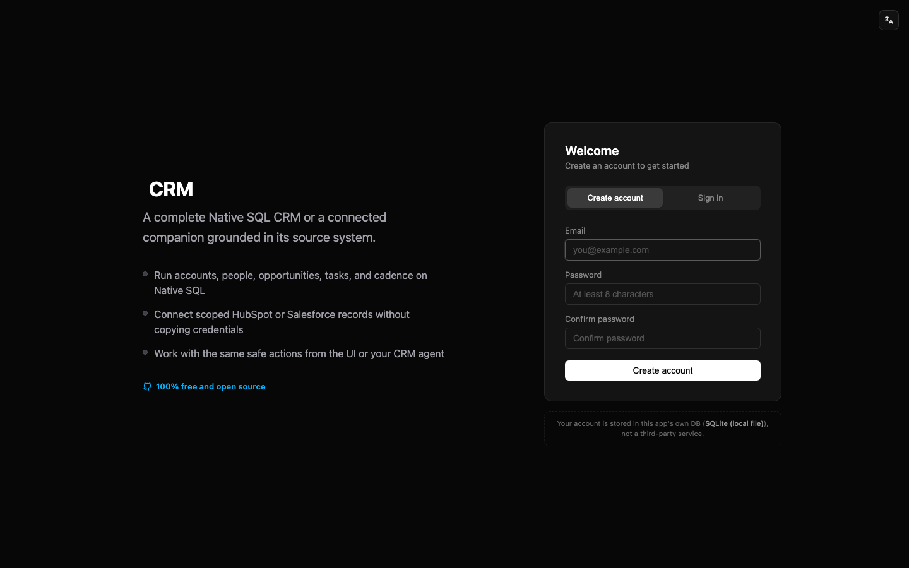
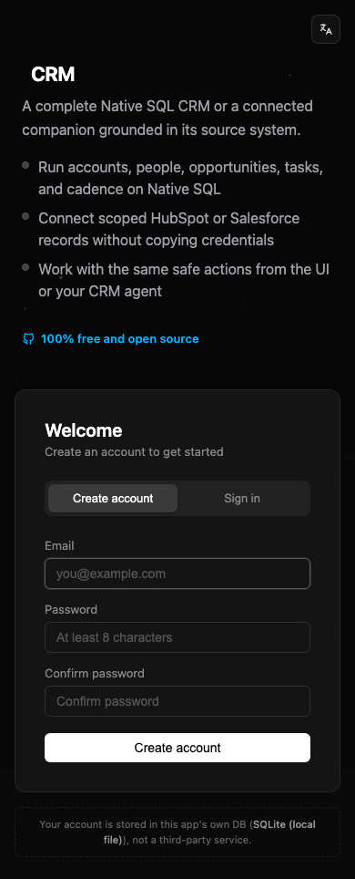
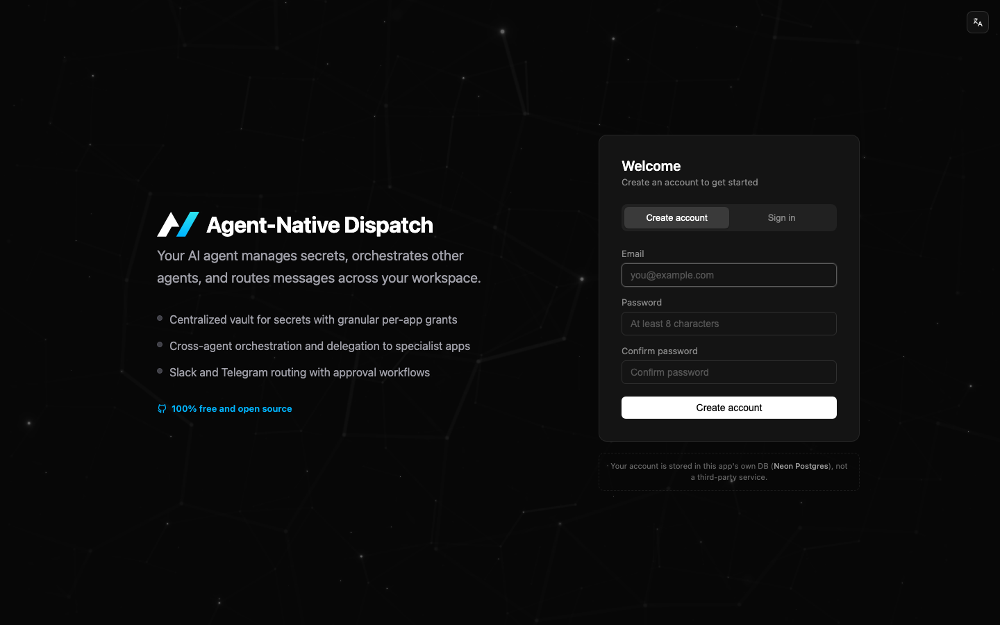
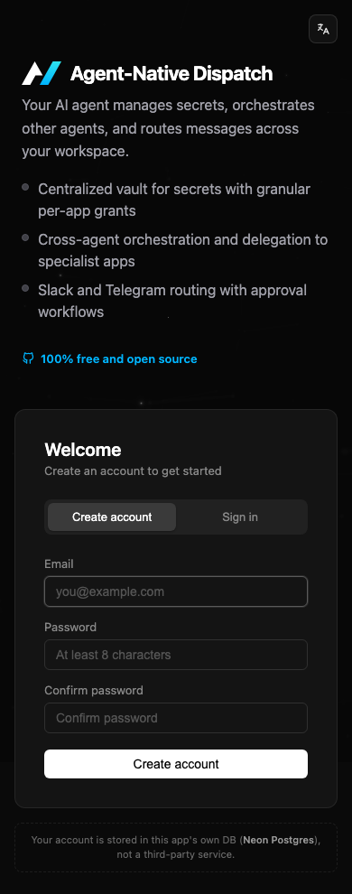
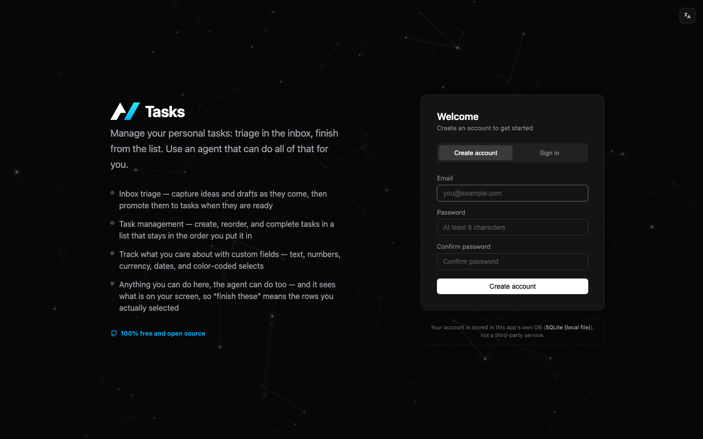
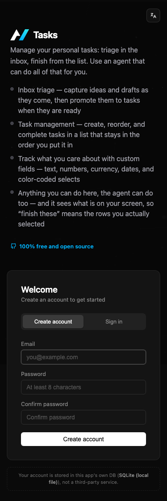
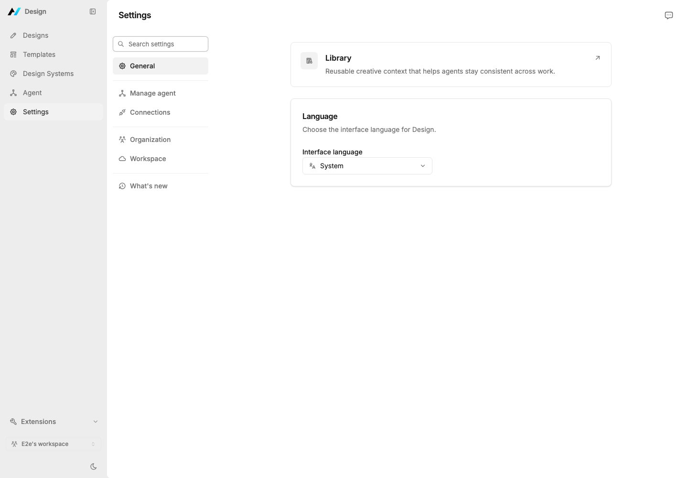
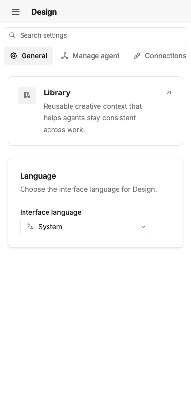

# Custom design systems for Agent Native

Companies can bring their existing React design system to Agent Native without
forking actions, state, sharing, settings, or agent-first feature behavior. One
semantic contract connects app UI, reusable Toolkit experiences, and selected
Core-owned surfaces.

<Callout id="custom-ds-decision" tone="decision">

Use both layers: a 17-component semantic bridge for controls and feature-level
headless controllers for product composition. One controller must power the
default view and every custom render path.

</Callout>

## Architecture

<Diagram
  id="custom-ds-architecture"
  data={{
    html: '

<strong>Customer package</strong>theme tokens17 semantic componentsnative overlay/focus stack

<strong>Typed bridge</strong>defineDesignSystemToolkitProviderper-control fallbackconformance major

<strong>Feature controllers</strong>actions + statetrackingview modelsproduct slots

<strong>Agent Native surfaces</strong>app screensToolkit kitsCore settings + sharingejected app-owned units

',
    css: ".custom-ds-map { display:grid; grid-template-columns:repeat(4,minmax(0,1fr)); gap:14px; } .custom-ds-map .diagram-card { display:grid; align-content:start; gap:8px; min-height:210px; padding:14px; } .custom-ds-map strong { font-size:15px; } .custom-ds-map span { border:1px solid var(--wf-line); border-radius:7px; padding:6px 8px; background:var(--wf-card); } .custom-ds-map .bridge,.custom-ds-map .controllers { background:var(--wf-accent-soft); } @media (max-width:860px) { .custom-ds-map { grid-template-columns:1fr; } }",
    caption:
      "Company presentation flows inward; Agent Native behavior flows outward through one stable controller path.",
  }}
/>

## Four customization tiers

<Table
  id="custom-ds-tiers"
  columns={["Tier", "Purpose", "Escape cost"]}
  rows={[
    [
      "1. Theme tokens",
      "Immediate brand alignment across default and uncovered surfaces",
      "No component ownership",
    ],
    [
      "2. Semantic components",
      "Render company controls inside shared features",
      "Own a typed adapter package",
    ],
    [
      "3. Product slots",
      "Replace a feature layout while reusing its controller",
      "Own one feature view",
    ],
    [
      "4. Eject",
      "Change unsupported feature structure or behavior",
      "Own the smallest exported unit",
    ],
  ]}
/>

Theme tokens are build-time only in version 1. `defineTheme` accepts standard
CSS colors, preserves explicit light and dark palettes, and generates the
existing semantic CSS-variable format through the Core Vite plugin. Dark tokens
fall back to light tokens; there is no automatic palette derivation and no
per-request or per-organization runtime theme.

## Semantic contract

<Table
  id="custom-ds-contract"
  columns={["Tier", "Components", "Core semantics"]}
  rows={[
    [
      "Leaf (9)",
      "ActionButton, IconButton, TextField, TextArea, Spinner, Skeleton, Status, Surface, Avatar",
      "intent, emphasis, size, pending, controlled values, validation, accessible labels and refs",
    ],
    [
      "Behavior (8)",
      "Tooltip, Menu, Popover, Dialog, Picker, Checkbox, Switch, Tabs",
      "controlled open/value state, keyboard and ARIA behavior, portal target, stacking, initial and restored focus",
    ],
  ]}
/>

The API is styling-runtime agnostic. `className` and `style` are optional
interoperability affordances; neither Tailwind nor CVA may leak into semantic
props. A customer component can use MUI-style providers, React Aria, CSS-in-JS,
CSS Modules, or plain React. Picker means select/combobox, not date picking.

Adapters are normal npm packages explicitly imported by
`app/design-system.ts`. There is no dependency scanning, auto-detection, or
JSON-loaded component code. Partial maps fall back to the default adapter. A
component render failure is isolated by a per-component boundary and falls back
to the default control while logging the error.

The legacy `components.Button` provider seam remains lowest precedence.
`designSystem.components.ActionButton` wins when both are present, with a
development warning.

## Behavior portability

<Callout id="custom-ds-overlays" tone="warning">

Behavior adapters may supply their own overlay and focus implementation
wholesale. Conformance must prove portal targeting, z-index stacking beside
Radix-hosted surfaces, controlled state, initial focus, and focus restoration.

</Callout>

This lets a company-native Dialog or Popover coexist with Toolkit surfaces
without forcing the customer component to wrap Radix. The `portalContainer`,
`initialFocusRef`, and `restoreFocusRef` seams are the interop boundary.

## One controller, two render paths

BuilderConnectCard and ChatHistoryRail are the proving slices. Settings and
sharing use the same model: actions, state, side effects, and tracking live in a
feature controller; both the built-in view and the customer slot consume its
view model.

The v1 `ChatHistoryRail` `renderRail` slot is intentionally opaque: it replaces
the rail view wholesale while receiving the shared controller and list props.
Discrete header, footer, or row slots are out of scope until a second product
needs them. This keeps the proving slice bounded without allowing a custom view
to fork history state or actions.

<Diagram
  id="controller-render-invariant"
  data={{
    html: '

<strong>Feature controller</strong>stateactionstrackingview model

<strong>Default render</strong>semantic controlsAgent Native layout

<strong>Custom render</strong>company componentsproduct-specific layout

',
    css: ".controller-map { display:grid; grid-template-columns:1.2fr 1fr 1fr; gap:18px; align-items:stretch; } .controller-map .diagram-card { display:grid; gap:8px; padding:16px; } .controller-map span { border:1px solid var(--wf-line); border-radius:7px; padding:6px 8px; } .controller-map .source { background:var(--wf-accent-soft); } @media (max-width:760px) { .controller-map { grid-template-columns:1fr; } }",
    caption: "No custom render path may reimplement feature state or actions.",
  }}
/>

## Delivery sequence

<Table
  id="custom-ds-sequence"
  columns={["Step", "Deliverable", "Proof"]}
  rows={[
    [
      "1",
      "Lock all 17 TypeScript contracts, default adapter, provider precedence, error fallback, and defineTheme",
      "Contract/unit tests, Core and Toolkit typechecks, SSR shell guard",
    ],
    [
      "2",
      "Standardize every live template on local adapters, app/design-system.ts, and ToolkitProvider",
      "Template drift guard, all-template typecheck, representative route builds and screenshots",
    ],
    [
      "3",
      "Normalize flagship Core surfaces onto Toolkit primitives without visual changes",
      "Focused tests and before/after parity review",
    ],
    [
      "4–5",
      "Extract BuilderConnectCard and ChatHistoryRail controllers and prove default/custom paths",
      "Both render paths use one controller",
    ],
    [
      "6",
      "Extract the settings controller from its presentation",
      "Section state and deep-link behavior remain presentation-independent",
    ],
    [
      "7",
      "Extract the sharing controller from its presentation",
      "Access, mutation, invite, visibility, and copy behavior remain intact",
    ],
    [
      "8",
      "Ship conformance, guards, eject units, docs, skills, changesets, and full verification",
      "Default + non-Tailwind fixtures, docs build, package tests, screenshots",
    ],
  ]}
/>

## Template standardization evidence

The repository catalogs 22 templates. Six are retired/ghost shells; the 16
live templates each expose a typed `app/design-system.ts` seam and provider
wiring. The standard preserves the default visuals when no custom system is
registered.

### CRM

### Dispatch

### Tasks

## Core normalization evidence

The shared Settings surface boots after Core’s raw controls were rebased onto
Toolkit primitives and its section/deep-link state moved into a controller.
These captures are post-normalization smoke evidence; visual parity is also
protected by the focused primitive tests and default-adapter path.

## Conformance and evolution

The importable `@agent-native/toolkit/conformance` kit runs in the customer
adapter’s CI. It checks all 17 components plus value/open control, roles,
keyboard interaction, option selection, portal placement, cross-stack z-index,
initial focus, and focus restoration. Agent Native proves the kit against both
the default shadcn/Radix adapter and a non-Tailwind CSS-in-JS fixture.

Contract evolution is explicit: new components and optional props are minor;
required props, removed components/props, or behavioral changes require a major
contract version and fail incompatible conformance runs.

## Version 1 boundaries

Theme tokens and feature slots can reach more surfaces than the component
bridge. The following UI ecosystems are not semantic component contracts in
version 1: `@assistant-ui/react`, Tiptap, `cmdk`, `vaul`, Recharts,
`react-day-picker`, and date picking generally. Dispatch’s independent primitive
fork and Pinpoint’s Solid.js/Shadow DOM UI are also outside the version 1 bridge.

## Files and ownership

<FileTree
  id="custom-ds-files"
  title="Public seams and proofs"
  entries={[
    {
      path: "packages/toolkit/src/design-system/",
      change: "added",
      note: "Contracts, default adapter, provider context, error fallback, and theme definition.",
    },
    {
      path: "packages/toolkit/src/conformance/",
      change: "added",
      note: "Importable contract, behavior, overlay, and focus verification.",
    },
    {
      path: "packages/core/src/vite/client.ts",
      change: "modified",
      note: "Build-time virtual theme CSS generation.",
    },
    {
      path: "templates/*/app/design-system.ts",
      change: "added",
      note: "Explicit app registration seam across live templates.",
    },
    {
      path: "packages/core/src/client/setup-connections/",
      change: "modified",
      note: "BuilderConnectCard controller and render slot proving slice.",
    },
    {
      path: "packages/toolkit/src/chat-history/",
      change: "modified",
      note: "ChatHistoryRail controller and render slot proving slice.",
    },
    {
      path: "packages/core/docs/content/custom-design-system.mdx",
      change: "added",
      note: "Customer guide, Acme example, recipes, conformance, and non-goals.",
    },
    {
      path: "packages/toolkit/agent-native.eject.json",
      change: "modified",
      note: "Fine-grained design-system and conformance ownership units.",
    },
  ]}
/>

## Acceptance criteria

- Default rendering is unchanged when no custom design system is registered.
- Every active template keeps its local adapter and provider seam load-bearing.
- A custom adapter can use no Tailwind, shadcn, Radix, or CVA code.
- Broken customer controls fail individually to a working default.
- Company-native overlays interoperate with hosted overlay stacks and focus.
- Default and custom feature views share one controller.
- Customer packages can run the conformance suite in CI.
- Build-time tokens preserve the public SSR cache-shell contract.
- Public docs teach MUI-style providers, React Aria, and CSS Modules.
- Package changes carry changesets; nothing requires auto-detection or JSON code loading.
